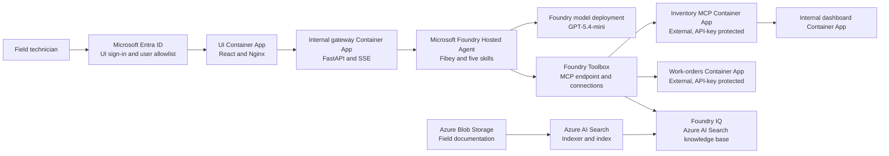

# Fibey Field Ops: hosted agents and MCP on Azure

Fibey is a field-operations assistant for a synthetic fiber network. It helps a technician prepare for a job by bringing together work orders, available parts, documented procedures, and network status in one conversation. The chat UI shows tool activity alongside the answer, making the orchestration visible rather than hiding it behind a chatbot.

This sample demonstrates **Microsoft Foundry Hosted Agents** with **Model Context Protocol (MCP)**, a standard interface for discovering and calling tools. It is for AI engineers and developers exploring the move from a working prototype to a reproducible, governed agent system. Foundry supplies the managed agent runtime; this repository supplies the agent code, operational services, UI, and Azure infrastructure.

> **Scope:** This is a protected, synthetic-data demonstration, not a production-ready field-service application. It deploys **one hosted agent, five instruction skills, and five supporting Azure Container Apps**. Multi-tool orchestration works today; multi-agent coordination is an explicitly labelled extension design. Durable application state, per-user session authorization, and enforced write approvals are not implemented.

**Start here:** [Deployment guide](deployment_guide.md) | [Engineering architecture](docs/architecture.md) | [Session walkthrough](docs/session-overview.md) | [Presentation deck](docs/slides/fibey-hosted-agents-mcp.pptx) | [Toolbox integration](docs/toolbox-integration.md)

## The solution in action

Start with a single inventory question, then ask for a complete job briefing. Fibey loads the relevant skill, selects tools from the available schemas, and grounds its answer in their results. A skill is an instruction document, not a separate agent or a security boundary.

The toolbox combines an MCP inventory service, an OpenAPI work-orders service, and an Azure AI Search knowledge base behind one MCP endpoint. Network status is a narrow inventory tool that reads the configured internal dashboard; it is **not browser automation**.

| Technician request | What the sample demonstrates |
|---|---|
| "Which OTDR equipment is in stock?" | Inventory search and stock checks through MCP |
| "Show me WO-007." | OpenAPI retrieval of a synthetic work order |
| "Find the documented fiber-splicing safety procedure." | Grounded knowledge retrieval with document citations |
| "What parts do I need for WO-007?" | Work-order lookup followed by inventory checks |
| "Brief me on WO-007, including stock, procedures, and network status." | One agent coordinating several tools into a job briefing |
| "Set the synthetic WO-007 status to in_progress, then read it back." | A disposable operational write; no enforced approval round trip |


The screenshot was captured from the authenticated sample deployment on 2026-09-17. It illustrates the app experience, not a reusable endpoint or a guarantee that another environment has passed deployment acceptance.

## Hosted solution architecture

The browser signs in through Microsoft Entra ID at the Azure Container Apps (ACA) UI boundary. Nginx proxies same-origin chat requests to the internal gateway, which invokes the Foundry-hosted agent using its Azure identity. Server-sent events (SSE) carry answer text, tool activity, citations, and completion back to the UI.

Foundry connections hold downstream credentials. Inventory and work orders have external ingress so the toolbox can reach them, but their operational endpoints require API keys. The gateway and dashboard have internal ACA ingress; that does not make the entire Azure deployment private.



The [complete engineering diagram](docs/architecture.md#complete-hosted-resource-diagram) adds deployment layers, Azure Container Registry, identities, storage and Search resources, control-plane operations, and telemetry. `azure.yaml` is authoritative: the agent uses the **Responses `2.0.0` protocol** and GPT-5.4-mini. There is no sixth ACA agent service in the hosted solution.

## What this sample teaches

As agents move beyond experimentation, the engineering problem becomes more than model selection. Fibey makes orchestration, access boundaries, deployment ordering, and failures observable in a small solution that can be explained end to end.

The [session walkthrough](docs/session-overview.md) maps these topics to specific prompts, source files, and evidence. It also distinguishes platform capabilities from controls that an application team still needs to implement.

The [16-slide PowerPoint deck](docs/slides/fibey-hosted-agents-mcp.pptx) includes the hosted Azure architecture on slide 9 immediately before the demo, and the actual app screenshot on slide 10. It also covers Fibey prompts, deployment, identity boundaries, production gaps, and speaker notes. It adapts the supplied Foundry capabilities presentation; retained recording links are background references, not evidence of the current deployment.

| Topic | Concrete teaching point |
|---|---|
| Standardized, composable tools | One MCP toolbox exposes six inventory/status tools, four OpenAPI operations, and one knowledge-retrieval tool |
| Dynamic tool use | Load a task-specific skill and use advertised tool names and input schemas; optional discovery wrappers are not required |
| Managed orchestration | `FoundryToolbox` and `ResponsesHostServer.run_async()` integrate agent code with the hosted runtime |
| Identity and governance | Separate UI sign-in, gateway invocation, agent identity, and downstream connection credentials |
| Control plane versus data plane | Provisioning resources does not prove that an identity can invoke the agent, query Search, or pull an image |
| DevOps and GitOps practices | Review Bicep, locked dependencies, image references, and toolbox versions; promote with explicit readiness gates |
| Debugging and observability | Follow the activity sidebar, response/session identifiers, ACA logs, and configured OpenTelemetry traces |
| Scale and multi-agent design | Identify single-replica application limits; discuss specialist-agent handoffs without claiming they are deployed |

## Deploy to Azure

Use the [deployment guide](deployment_guide.md) from the repository root. It covers prerequisites, scoped role-based access control (RBAC), the complete staged rollout, acceptance checks, and operational troubleshooting. Use your own subscription, supported region, Foundry project, and allowed-user identity; no demonstrator's endpoints are reusable defaults.

The order matters: provision Foundry, configure protected-service prerequisites, provision placeholder apps, publish all five supporting images, and provision the supporting layer again to apply images with the correct ports and probes. Then configure knowledge and toolbox connections and deploy `fibey-agent`.

> Do not use a one-command initial deployment. Plain `azd deploy <supporting-service>` preserves placeholder port 80 and does not perform the initial switch to the APIs' real ports. Follow the guide's `azd publish` then `azd provision infra` sequence.

## Run locally

Use Python 3.12+, [uv](https://docs.astral.sh/uv/), Node.js 24 LTS, and an Azure developer login with access to a configured Foundry project, model, and toolbox. Local execution still calls Azure; it is not an offline simulation.

Local servers do not provide the cloud Entra boundary. Keep them on loopback, use synthetic data, and do not expose them publicly. A cloud toolbox cannot reach your workstation's `localhost`. See [local development](docs/local-development.md) for configuration and API examples.

From the repository root:

```powershell
uv sync --frozen
Copy-Item .env.example .env
```

Set `FOUNDRY_PROJECT_ENDPOINT`, `FOUNDRY_MODEL`, and `TOOLBOX_MCP_URL` in the ignored `.env`, then start the gateway:

```powershell
az login
uv run --frozen uvicorn fibey.gateway.api_server:app --host 127.0.0.1 --port 8080
```

In another terminal:

```powershell
Set-Location ui
npm ci
npm run dev
```

Open <http://localhost:5173>. Vite proxies `/api` to port 8080. For terminal-only use, run `uv run --frozen python -m fibey.agent.main` from the root.

## Production considerations

The managed runtime is a foundation for production engineering, not a substitute for application controls. The gateway's conversation mappings and synthetic work orders remain in memory and use one replica. **Reset chat clears chat context, not work orders**; restarting the work-orders service reloads its seed data.

Before using real operational data, add durable state, server-enforced session ownership, approval and audit workflows, secret rotation, appropriate network isolation, load testing, and recovery procedures. Foundry's scaling capabilities do not remove the sample's application bottlenecks. The knowledge-base integration uses preview APIs, so review current service availability and support terms.

OpenTelemetry is enabled in hosted code; sensitive content tracing is off unless `ENABLE_SENSITIVE_TELEMETRY=true`. ACA logs go to Log Analytics. Verify the hosted project's telemetry destination separately: the repository does not provision an Application Insights resource or guarantee that all traces have reached a linked sink.

## Repository guide

Agent logic lives separately from gateway and frontend code so each can evolve without changing the tool services' contracts. Infrastructure and setup scripts capture the deployment sequence; the repository does not currently ship a CI/CD workflow or a GitOps reconciliation controller.

Use these entrypoints to follow a request or adapt one component. The [deployment compatibility page](docs/deployment.md) points to the same root guide, so there is one maintained deployment procedure.

| Path | Purpose |
|---|---|
| `azure.yaml` | Authoritative Foundry project, hosted agent, and five ACA services |
| `infra/foundry/`, `infra/` | Foundry resources and supporting Bicep infrastructure |
| `src/fibey/agent/hosted.py` | Hosted entrypoint, skills, toolbox, and telemetry lifecycle |
| `src/fibey/agent/agent.py` | Local agent implementation |
| `src/fibey/gateway/api_server.py` | Validated chat API, session mappings, and SSE translation |
| `src/fibey/agent/skills/` | Five instruction skills bundled in the agent image |
| `ui/` | React, TypeScript, Tailwind, and Nginx UI |
| `services/` | Inventory, work orders, status dashboard, and knowledge documents |
| `scripts/setup-knowledge-base.ps1` | Upload, index, and configure knowledge retrieval |
| `scripts/setup-toolbox.ps1` | Configure connections and publish the toolbox |
| `tests/` | Local runtime, gateway, hosted integration, and tool-service regression tests |

Run the existing checks from the root:

```powershell
uv run --frozen python -m unittest discover -s tests -p "test_*.py"
Set-Location ui
npm ci
npm run build
```

## License and attribution

Licensed under the [MIT License](LICENSE), with the Microsoft Corporation copyright notice and the original David Barkol attribution retained. Third-party dependencies retain their own licenses.

Fibey originated in `agent-tools-and-integrations/toolbox-fibey-demo` in [leestott/build-2026-demos](https://github.com/leestott/build-2026-demos). This repository focuses on the standalone field-operations solution and its protected hosted deployment.
