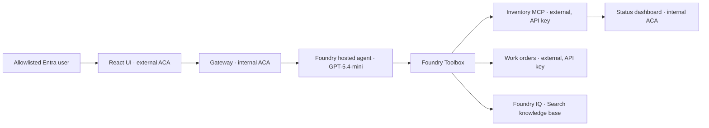

# Fibey Field Ops

This standalone repository contains only the Fibey solution, extracted from `agent-tools-and-integrations/toolbox-fibey-demo` in [leestott/build-2026-demos](https://github.com/leestott/build-2026-demos), including the deployment improvements. The repository root is the application root for all commands in this guide. The original [MIT license](LICENSE) and attribution are retained.

Fibey demonstrates how a field-operations assistant can use inventory, synthetic work orders, documented procedures, and network status through one **Microsoft Foundry Toolbox** endpoint. Start with a parts lookup, then follow the activity sidebar to see how a larger job briefing combines tools.

The cloud design is a protected demo, not a production field-service system. `azure.yaml` is the deployment source of truth: a Foundry project, a **GPT-5.4-mini hosted agent using Responses 2.0**, and **five supporting Azure Container Apps**. Provisioning alone does not mean the tools or chat experience are ready; complete the verification steps in [Deployment](docs/deployment.md).

## What you can explore

The examples below build from one tool to several. Inventory contains synthetic parts and stock; work-order changes affect disposable, in-memory demo data.

The assistant loads a task-specific skill before using operational tools. The deployed toolbox exposes its **11 operational tools directly**; `tool_search` and `call_tool` are optional interfaces for other toolbox configurations, not required steps. A skill is a small instruction document, not an additional service or a permission boundary.

- **Inventory:** “Which OTDR equipment is in stock?”
- **Work orders:** “Show me WO-007.”
- **Knowledge:** “Find the documented fiber-splicing safety procedure.”
- **Job preparation:** “What parts do I need for WO-007?”
- **Combined briefing:** “Brief me on WO-007, including stock and relevant procedures.”
- **Network status:** “Check the network status.” This loads `inventory-lookup` and uses the narrow `get_network_status` inventory tool, **not browser automation**.

## Protected cloud architecture

The browser reaches only the UI. Azure Container Apps handles its Microsoft Entra sign-in and user allowlist; Nginx forwards chat requests to the internal gateway. The gateway calls the Foundry-hosted agent with an Azure credential.

Foundry connections hold the downstream credentials. Inventory and work orders have external endpoints so the toolbox can reach them, but their operational APIs require keys. “External” does not mean anonymous access.



There is no sixth ACA agent service in this deployment. `src/fibey/agent/service.py` remains an optional local/legacy adapter, not a service in the protected stack.

## Run locally

Use Python 3.12+, [uv](https://docs.astral.sh/uv/), and Node.js 24 LTS. Local execution still needs a configured Foundry project, model, and toolbox, plus an Azure developer login with access to them.

The local UI and development servers do **not** provide the cloud Entra boundary. Bind development services to loopback, use synthetic data, and do not expose them publicly. A cloud toolbox cannot reach `localhost` on your workstation.

From this demo directory, install the locked Python dependencies and create your configuration:

```powershell
uv sync --frozen
Copy-Item .env.example .env
```

Edit `.env`, setting `FOUNDRY_PROJECT_ENDPOINT`, `FOUNDRY_MODEL`, and `TOOLBOX_MCP_URL`. Start the gateway in one terminal:

```powershell
uv run --frozen uvicorn fibey.gateway.api_server:app --host 127.0.0.1 --port 8080
```

In another terminal, install and start the UI:

```powershell
Set-Location ui
npm ci
npm run dev
```

Open <http://localhost:5173>. Vite proxies `/api` to the gateway on port 8080. For a terminal-only conversation, use `uv run --frozen python -m fibey.agent.main`.

## Deploy and verify

Deployment is deliberately staged: provision Foundry and configure prerequisites, then run `azd provision infra` for placeholder apps and their registry links. Verify all `AcrPull` roles, use `azd publish <service>` for each of the five supporting services, and run `azd provision infra` again to apply their images with the correct ports and probes. Configure knowledge and toolbox connections before running `azd deploy fibey-agent`.

Follow [the deployment guide](docs/deployment.md) rather than using a one-command all-services deployment. Plain `azd deploy` preserves placeholder port 80, so it cannot perform the initial switch to the supporting APIs' ports 8000–8003. Never copy a previous demonstrator's endpoints or secrets into reusable defaults.

The reference deployment is project `leestott-mcpchennai` in subscription `ai-team`, North Central US. As of 2026-09-17, all five supporting apps, hosted agent version 1, and toolbox version 5 are deployed. A hosted briefing retrieved work orders, inventory, network status, and cited knowledge documents. The UI proxy also completed streaming chat, follow-up context, and chat reset. These are deployment-specific results, not defaults to reuse for your own environment.

Open the [protected Fibey UI](https://leestott-mcpchennai-ui.delightfulwave-889e74b6.northcentralus.azurecontainerapps.io) and sign in with the allowlisted account `leestott@foundrybami2610.onmicrosoft.com`. Interactive browser sign-in still requires that user's session.

## Demo boundaries and validation

The gateway uses one replica because conversation mappings are held in memory. Work orders also use one replica and an in-memory copy of seed data: restarting that service resets its changes. **Reset chat clears chat history, not work orders.**

The UI has no enforced approval workflow. Synthetic work-order writes can execute without a human approval round trip. Before adapting this sample to real operations, add durable storage, per-user session authorization, enforced approvals, stronger operational controls, and appropriate networking.

Run the local regression checks without making cloud calls:

```powershell
uv run --frozen python -m unittest discover -s tests -p "test_*.py"
Set-Location ui
npm run build
```

OpenTelemetry stays enabled in hosted mode. Message content is excluded by default; `ENABLE_SENSITIVE_TELEMETRY=true` explicitly opts into sensitive tracing and should not be enabled for real customer data.

## Find the implementation

The table points to the current entrypoints and guides. Read the deployment guide before changing resources, and the toolbox guide before changing tool authentication.

Other narrative documents in `docs/` preserve earlier demo walkthroughs; they are not authoritative deployment instructions for this protected stack.

| Path | Purpose |
|---|---|
| `azure.yaml` | Authoritative Foundry project, hosted agent, and five ACA services |
| `src/fibey/agent/hosted.py` | Supported `FoundryToolbox` + `ResponsesHostServer` integration |
| `src/fibey/agent/agent.py` | Local agent and activity translation |
| `src/fibey/gateway/api_server.py` | Validated chat API and SSE streaming |
| `src/fibey/agent/skills/` | Five bundled field-operations skills |
| `services/` | Inventory, work orders, dashboard, and knowledge documents |
| `scripts/setup-knowledge-base.ps1` | Upload and index documents, configure knowledge retrieval |
| `scripts/setup-toolbox.ps1` | Register protected tool connections and publish the toolbox |
| [Deployment](docs/deployment.md) | Staged provisioning, access controls, and verification |
| [Toolbox integration](docs/toolbox-integration.md) | Authentication, skills, and streaming contracts |
| [Hosted infrastructure notes](infra-agent/README.md) | How hosted runtime and supporting infrastructure fit together |

Licensed under the MIT License; see [LICENSE](LICENSE).
