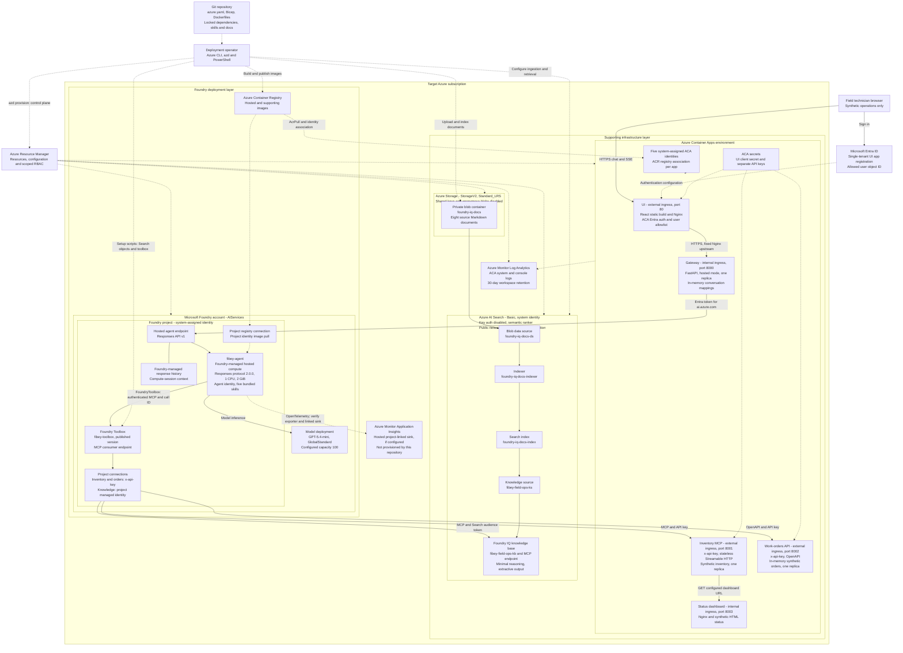
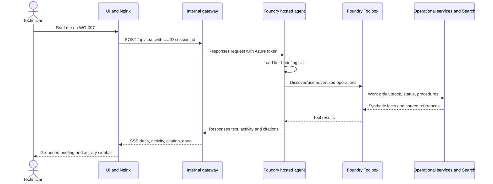

# Fibey hosted solution: engineering architecture

Fibey turns a technician's question into a tool-grounded response over synthetic fiber-operations data. Microsoft Foundry runs the agent code; Azure Container Apps (ACA) runs the five supporting services. Model Context Protocol (MCP) standardizes how the agent discovers and invokes the toolbox's capabilities.

This document describes the resources and contracts declared in this repository, not a claim that a particular environment is live. Use [the deployment guide](../deployment_guide.md) to provision and verify an environment. `azure.yaml` is the deployment source of truth; there is no separate `agent.yaml`.

For presentations, use the [application architecture image](images/fibey-hosted-architecture.png) or slide 9 of the [PowerPoint deck](slides/fibey-hosted-agents-mcp.pptx). The deck places this visual immediately before the live-app demo on slide 10. The engineering diagram below expands the resource and identity detail.

## Complete hosted resource diagram

The diagram separates application traffic from provisioning, image delivery, ingestion, and telemetry. The two deployment-layer boxes are logical groupings, not private-network boundaries or a guarantee of separate resource groups; actual resource-group names come from the selected azd environment.

Solid arrows show application and knowledge flows. Dotted arrows show deployment, identity configuration, image delivery, and telemetry. The Application Insights box is explicitly conditional: the hosted platform can supply a linked telemetry destination, but no Application Insights resource is declared by this repository's Bicep.

### Resource ownership and lifecycle

| Resource or object | Created/configured by | Important boundary |
|---|---|---|
| Foundry account, project, model, registry integration | `azure.yaml`, `infra/foundry/`, azd Foundry layer | Model quota and role assignments must be checked in the chosen region/project |
| Hosted agent image, immutable version, endpoint, runtime identity | `azd deploy fibey-agent` and Foundry | Managed runtime, not an ACA app in this environment |
| ACA environment and five apps | `infra/main.bicep`, `infra/apps.bicep` | Initial placeholder ports differ from application ports |
| UI Entra app registration and secret | Operator prerequisite; ACA auth config in Bicep | Application/client ID and allowed user object ID are different values |
| System identities, scoped role assignments, ACA secrets | Bicep using environment inputs | Registry association and `AcrPull` are both required |
| Storage account and private document container | Supporting Bicep | Private container access is not a private network endpoint |
| Search service and identity | Supporting Bicep | Indexes and knowledge objects do not exist merely because Search is provisioned |
| Documents, data source, indexer, index, knowledge source/base | `scripts/setup-knowledge-base.ps1` | Identity-based ingestion; no embedding deployment in this pipeline |
| Foundry knowledge connection and toolbox connections/version | Both setup scripts, in order | Credentials remain in connections; toolbox definition contains references |
| ACA Log Analytics workspace | Supporting Bicep | Captures supporting-service logs, not proof of hosted trace ingestion |
| Hosted Application Insights/exporter destination | Foundry project/platform configuration, verified by operator | Not provisioned by this repository |

## Request orchestration and tool contracts

One hosted `Agent` routes requests using five skills: `inventory-lookup`, `work-order-management`, `knowledge-retrieval`, `work-order-preparation`, and `field-briefing`. The larger skills combine operations; they do not instantiate specialist agents.

The toolbox configuration exposes eleven operational tools. The model chooses from the advertised names and schemas after loading the relevant instructions. A toolbox connection is a common access surface, not a replacement for downstream authentication or authorization.

| Backend | Operations | Contract |
|---|---|---|
| Inventory MCP | `list_parts`, `search_parts`, `get_part_details`, `check_stock`, `check_stock_batch`, `get_network_status` | Stateless Streamable HTTP; exact exposed names may include a server prefix |
| Work Orders OpenAPI | `list_work_orders`, `get_work_order`, `create_work_order`, `update_work_order` | Live OpenAPI 3 schema; connection credential under HTTP header name `x-api-key` |
| Foundry IQ MCP | `knowledge_base_retrieve` | Use advertised schema, including the required `query_variants` structure |

`FoundryToolbox` forwards hosted platform context, including the runtime call ID. `ResponsesHostServer.run_async()` owns the supported hosting lifecycle. The entrypoint closes clients and credentials on exit; history retrieval errors must fail the turn rather than silently dropping context.

## Identity, network, and permission boundaries

Role-based access control (RBAC) grants a principal permission at a resource scope. The **control plane** manages Azure resources and configuration; the **data plane** invokes models, agents, tools, and Search queries or reads/writes blobs. Successful provisioning is not evidence that all data-plane calls are authorized.

Keep the identities separate when debugging. A signed-in browser user is not automatically the identity used for every downstream call: the gateway uses its managed identity, the hosted container uses the platform-provided agent identity, and the knowledge connection explicitly uses the Foundry project managed identity.

| Hop | Identity or credential | Enforcement |
|---|---|---|
| Browser to UI | Entra user and UI application registration | ACA authentication plus explicit user allowlist |
| UI to gateway | Internal ACA network path | Nginx fixed upstream; no separate per-user authorization in gateway |
| Gateway to hosted endpoint | Gateway system-assigned identity | Project-scoped Azure AI User role |
| Hosted agent to model/toolbox | Foundry-provided agent identity via SDK credential | Project/model/toolbox permissions and runtime call context |
| Platform to hosted image | Project managed identity / configured registry connection | Registry pull permission; distinct from agent runtime identity |
| Toolbox to inventory/orders | Separate API keys in project connections | Operational endpoints validate `x-api-key` |
| Toolbox to knowledge base | Foundry project managed identity | Search Index Data Reader on Search |
| Search indexer to blobs | Search system-assigned identity | Storage Blob Data Reader on document storage |
| ACA apps to images | Each app's system-assigned identity | `AcrPull` on ACR plus explicit registry identity association |

The UI, inventory, and work-orders ingress endpoints are external. Gateway and dashboard ingress are internal to the ACA environment. Foundry network isolation is optional and off by default; Search public network access is enabled. No default end-to-end private endpoint topology, firewall appliance, API Management gateway, or Key Vault is declared. Optional Foundry network modules do not automatically isolate Search, Storage, or all supporting services.

## State, streaming, and observability

The gateway translates the Foundry Responses stream into the UI's SSE contract. It validates UUID session IDs and messages of 1 to 16,000 characters, exposes `X-Session-Id`, rejects overlapping requests for a session, and accepts only configured exact CORS origins.

Conversation continuity has two identifiers: `previous_response_id` links response history and `agent_session_id` preserves hosted compute affinity. Both mappings live in gateway memory. Foundry's managed history does not make these application mappings durable or enforce user ownership of a session.

| Event | UI meaning |
|---|---|
| `delta` | Assistant text chunk |
| `activity` | Tool activity for the sidebar |
| `citation` | Knowledge source reference |
| `error` | Request, tool/runtime, or stream failure |
| `done` | Stream terminator with `[DONE]`; an earlier error still means failure |

Premature EOF, malformed streams, timeouts, and response-level failures must surface as errors. Reset clears the gateway's local history and hosted mappings; it does not delete the old remote compute session or reset work orders.

ACA environment logs flow to Log Analytics. Hosted code enables OpenTelemetry, a standard format for traces and metrics, with sensitive message content disabled by default. Inspect the project's linked Application Insights/exporter configuration and confirm receipt of a synthetic trace before promising end-to-end visibility. The activity sidebar is a user-facing view, not a durable audit log.

## Deployment reproducibility and production evolution

The deployment separates resource provisioning from image publication and application readiness. The first supporting-infrastructure pass creates placeholder apps on port 80; after all five image settings exist, a second pass applies the images with their actual ports and probes. Knowledge ingestion and toolbox registration precede hosted-agent deployment.

The source, Bicep, dependency locks, and versioned artifacts support a DevOps workflow. GitOps adds reviewed desired state and controlled reconciliation; this repository provides the ingredients, not a running CI/CD pipeline or GitOps controller. See [release practices](../deployment_guide.md#devops-gitops-and-release-management) for a proposed promotion process.

| Production concern | Implemented here | Required before real operations |
|---|---|---|
| Application scale | Managed hosted runtime; one replica for gateway, inventory, and orders | Externalize session/order state; load-test concurrency, quotas, and downstream limits |
| Data persistence | Seeded synthetic orders in process memory | Durable transactional store, backup/restore, idempotent writes |
| User isolation | UI login and allowlist; UUID conversation handles | Server-enforced session ownership and downstream authorization |
| Operational approvals | No enforced approval UI; unattended tool calls | Runtime pause/resume and server-side approval bound to exact write arguments |
| Network protection | Internal gateway/dashboard; protected external APIs | Workload-specific private networking, egress policy, and secret rotation |
| Reliability | Bounded inputs, stream failure handling, explicit setup checks | SLOs, alerts, recovery drills, evaluation and release gates |
| Multi-agent coordination | One agent orchestrates multiple tools | Separate specialist identities, typed handoffs, budgets, and durable coordination |

For the proposed specialist-agent design, see [multi-agent coordination](session-overview.md#multi-agent-coordination-extension-not-deployed). It is intentionally separate from the deployed diagram.

## Source references

The repository implementation determines what this sample does. The platform references explain the managed capabilities and responsibilities that surround it; service support and API versions can change independently of a pinned sample.

Consult both before adapting the design, especially for agent identity, approval enforcement, telemetry, and private networking.

| Reference | Use |
|---|---|
| [`azure.yaml`](../azure.yaml), [`infra/apps.bicep`](../infra/apps.bicep), [`infra/modules/access.bicep`](../infra/modules/access.bicep) | Deployment services, topology, and scoped role assignments |
| [`hosted.py`](../src/fibey/agent/hosted.py), [`api_server.py`](../src/fibey/gateway/api_server.py) | Hosted runtime and gateway behavior |
| [What are hosted agents?](https://learn.microsoft.com/azure/foundry/agents/concepts/hosted-agents) | Managed compute, runtime identity, versions, and observability |
| [Use a toolbox with a hosted agent](https://learn.microsoft.com/azure/foundry/agents/how-to/tools/use-toolbox-hosted-agent) | SDK integration, endpoints, and application-enforced approvals |
| [Toolbox overview](https://learn.microsoft.com/azure/foundry/agents/concepts/toolbox-overview) | Shared MCP tool surface and connection management |
