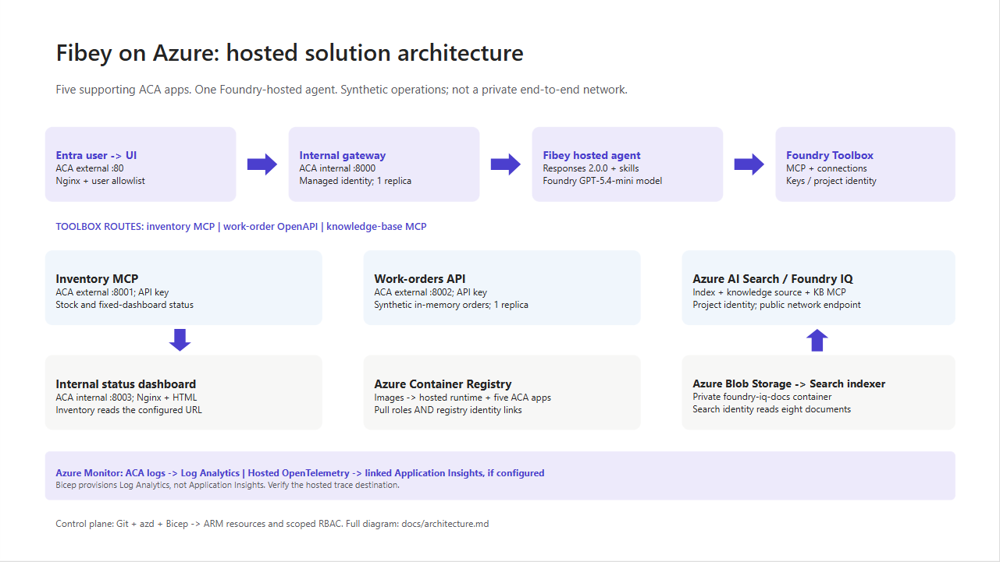
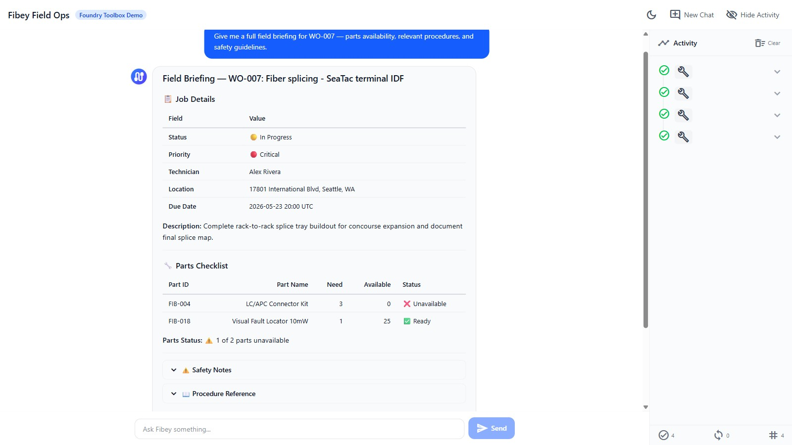

# Microsoft Foundry Hosted Agents and MCP in Practice: Building Fibey Field Ops

An agent can produce a convincing answer while the system around it is still difficult to deploy, authorize, debug, and recover. For AI engineers and developers, that is often the real gap between a promising prototype and an application people can depend on.

Fibey Field Ops makes that gap concrete. It is a synthetic fiber-operations assistant built with Microsoft Foundry Hosted Agents, Model Context Protocol (MCP), and Azure Container Apps. This walkthrough follows one field-service task through the implementation, then examines the deployment and operational decisions behind it.

## Introduction: the application is more than the model

Imagine a technician preparing a fiber work order. Before leaving the depot, they need the job details, available parts, relevant procedures, and network status. Those facts belong to different systems. A useful assistant must retrieve them, combine them, and explain what is missing without inventing an answer.

The challenge is not simply selecting a capable model. It is establishing reliable contracts between the model, its tools, the hosting platform, and the application. Fibey demonstrates those contracts with **one hosted agent, five instruction skills, eleven operational tools, and five supporting Container Apps**.

There is an important qualification: Fibey is a protected, synthetic-data demonstration, not a production-ready field-service system. Its gateway mappings and work orders remain in memory, and it does not enforce per-user session ownership or approval of operational writes. Those limitations are useful teaching material rather than details to hide.

The [Fibey repository](https://github.com/leestott/fibey-toolbox-demo) contains the implementation, infrastructure, documentation, and presentation deck. Repository access depends on its permissions.

## 1. Separate reasoning, instructions, and tool execution

MCP is a standard interface for discovering and invoking tools. In Fibey, the agent connects to one Microsoft Foundry Toolbox MCP endpoint. The toolbox exposes capabilities backed by an inventory MCP server, a work-orders OpenAPI service, and a Search knowledge base.

That common interface does not make the underlying systems identical. OpenAPI still describes an HTTP API, inventory still implements MCP, and knowledge retrieval still depends on indexed documents. The toolbox centralizes the agent-facing integration and connection configuration while preserving those implementation choices.

Four terms describe different responsibilities:

| Concept | Responsibility in Fibey |
|---|---|
| Agent | Classifies the request, loads instructions, selects tools, and constructs the response |
| Skill | An instruction document for a task such as inventory lookup or field briefing |
| Tool | An operation with an advertised input schema and a result |
| Toolbox | The curated MCP surface and references to downstream connections |

Fibey's five skills cover inventory lookup, work-order management, knowledge retrieval, work-order preparation, and field briefings. The last two coordinate several tools; they do not create additional agents.

The configured toolbox exposes eleven operational tools directly: six inventory/status operations, four work-order operations, and one knowledge-retrieval operation. The agent uses their actual names and schemas. Discovery wrappers such as `tool_search` and `call_tool` are relevant only when a toolbox exposes them; they are not mandatory steps before every call.

This distinction matters when debugging. A missing wrapper is not necessarily a broken integration. A skill mentioning a capability is also not proof that the runtime can invoke it. The current tool schema is the executable contract.

## 2. Follow the hosted Azure architecture

Microsoft Foundry hosts the agent container and exposes its endpoint. Azure Container Apps (ACA) hosts the application services around it. The deployment source of truth is `azure.yaml`, which declares the GPT-5.4-mini model deployment and the hosted agent's Responses `2.0.0` protocol.

The design keeps the browser-facing application separate from agent execution and backend integration. That makes it easier to inspect each boundary, but it does not make the whole deployment private or remove the need for application authorization.

Treat GPT-5.4-mini as the sample's configured baseline, not a claim that it is optimal for every workload. When evaluating another model, measure tool-selection accuracy, schema compliance, grounded answers, latency, and cost per completed task rather than choosing from a fluent demo response alone.



The [engineering architecture](../architecture.md) expands this presentation view with resource ownership, identities, configuration, and telemetry paths.

### The application request path

The browser signs in through Microsoft Entra ID at the UI's ACA authentication boundary. An explicit allowlist restricts access to the intended user. Nginx serves the React application and proxies chat requests to the internal FastAPI gateway.

The gateway invokes the Foundry-hosted agent using its managed identity. Server-sent events (SSE), a streaming HTTP format, carry answer text, tool activity, citations, failures, and completion back to the UI.

Gateway and dashboard ingress are internal to the ACA environment. Inventory and work orders have external ingress so the toolbox can reach them, but their operational endpoints require separate API keys. External accessibility is not anonymous access, and internal ingress is not a complete network-isolation strategy.

### The knowledge and status paths

The knowledge pipeline starts with eight Markdown documents in the repository. A setup script uploads them to a private Blob Storage container, configures a Search data source and indexer, verifies ingestion, and creates the knowledge source and knowledge base used by Foundry IQ.

This is not an embedding pipeline assembled implicitly by the chat application. The current configuration uses minimal reasoning and extractive retrieval, with defaults of three output documents and 6,000 output tokens. Its knowledge-base configuration and MCP endpoint use preview APIs, which need lifecycle and support review before production adoption.

Network status takes a different path. Inventory's `get_network_status` tool reads the configured internal HTML dashboard. It is a narrow HTTP fetch, not browser automation, arbitrary website navigation, or a real operational clearance.

Azure Container Registry supplies container images. ACA logs go to Log Analytics. Hosted code enables OpenTelemetry, the standard instrumentation framework for traces and metrics, but the repository does not provision Application Insights. The project's linked trace destination must be configured and verified separately.

## 3. Trace a work-order briefing through the implementation

The most useful demonstration starts with one concrete request: prepare a technician for a job. The `field-briefing` skill provides the instructions for combining work-order data, inventory, procedures, and status without pretending that one backend contains everything.

Use a request such as the following in a prepared synthetic environment. The exact wording and tool order may vary; the important evidence is which operations succeeded and which facts support the answer.

> Brief me on WO-007, including stock, relevant procedures, safety, and network status.

The intended flow is:

1. Load the field-briefing instructions and retrieve WO-007.
2. Identify required parts and use a batch stock check when several parts need checking.
3. Combine procedure and safety questions into one focused knowledge retrieval.
4. Read the configured synthetic status dashboard through inventory MCP.
5. Produce a briefing grounded in successful results, with source references and explicit gaps.

Batching is a useful engineering choice, not a claim of a measured performance improvement. One batch stock call avoids unnecessary repeated requests. Combining related retrieval questions can also reduce duplicate context and tool traffic.



This screenshot was captured from an authenticated deployment on September 17, 2026. The displayed briefing identifies an unavailable connector kit and available test equipment. It illustrates a specific synthetic response, not current stock or a benchmark.

### Use the supported hosted integration

The relevant implementation is [the hosted entrypoint](../../src/fibey/agent/hosted.py). It uses `FoundryToolbox` from `agent_framework_foundry_hosting`, a `FoundryChatClient`, a skills provider, and `ResponsesHostServer.run_async()`.

The hosting helper does more than attach a bearer token. It authenticates MCP requests and forwards the hosted runtime's per-request call ID. Replacing it with a generic transport can lose context that the platform expects. The entrypoint also closes credentials and clients when execution exits.

Hosted skill discovery prefers published skills when available and retains bundled instructions as a fallback in `auto` mode. Explicit `mcp` mode fails if published skills cannot be loaded; `file` mode uses the bundled documents. This makes the fallback intentional rather than silently running without the task instructions.

### Distinguish history from compute affinity

The gateway maintains two hosted mappings. `previous_response_id` links conversation history, while `agent_session_id` preserves affinity to the hosted compute session. Losing one is not equivalent to losing the other.

Both mappings are held in gateway memory, which is why it remains at one replica. A UUID (universally unique identifier) is a conversation handle, not proof of ownership. Reset clears the local mappings but does not reset work orders or delete the old remote compute session.

There is also a privacy distinction between storage and telemetry. Gateway requests use stored Responses history, while the agent's model-call options use `store: false`. Sensitive tracing being disabled does not mean all conversation persistence is disabled.

## 4. Run locally without confusing development and cloud boundaries

Local development is useful for inspecting the gateway and agent without rebuilding the hosted image. It still calls a real Foundry project, model, and toolbox. It is not an offline simulation, and tool writes can affect the configured synthetic backend.

Use Python 3.12+, uv, Node.js 24 LTS, and an authorized Azure developer identity. The commands below run from the repository root in PowerShell. Keep the existing dependency locks and copy `.env.example` only when creating a new local configuration.

```powershell
uv sync --frozen
Copy-Item .env.example .env
```

Set `FOUNDRY_PROJECT_ENDPOINT`, `FOUNDRY_MODEL`, and `TOOLBOX_MCP_URL` in the ignored `.env`. Use your environment's actual values. Backend API keys belong in Foundry connections, not in the browser or prompts.

Start the gateway:

```powershell
az login
uv run --frozen uvicorn fibey.gateway.api_server:app --host 127.0.0.1 --port 8080
```

In another terminal, start the UI:

```powershell
Set-Location ui
npm ci
npm run dev
```

Open `http://localhost:5173`. Vite forwards `/api` to the gateway on port 8080. These development servers do not reproduce the cloud Entra boundary, and a cloud toolbox cannot reach your workstation's `localhost`.

### Inspect the API progressively

With the local gateway running, start with a health request in a separate PowerShell terminal:

```powershell
$base = "http://127.0.0.1:8080"
Invoke-RestMethod "$base/api/health"
```

Next, create a UUID conversation and submit one synthetic request:

```powershell
$session = [guid]::NewGuid().ToString()
$body = @{ message = "Show me WO-007."; session_id = $session } | ConvertTo-Json -Compress
$response = Invoke-WebRequest "$base/api/chat" -Method Post -ContentType "application/json" -Body $body
$response.Headers["X-Session-Id"]
$response.Content
```

This prints the completed SSE body rather than animating the stream. Reuse the same session for a follow-up by extracting a small helper:

```powershell
function Invoke-FibeyTurn {
    param([string] $Message, [string] $SessionId)
    $payload = @{ message = $Message; session_id = $SessionId } | ConvertTo-Json -Compress
    $result = Invoke-WebRequest "$base/api/chat" -Method Post `
        -ContentType "application/json" -Body $payload
    return $result.Content
}
Invoke-FibeyTurn -Message "What parts does that work order need?" -SessionId $session
```

The helper uses `$base` and `$session` from the preceding examples. It makes continuity explicit without hiding the API contract. The browser remains the better place to watch incremental text and activity. See [local development](../local-development.md) for reset behavior and supporting-service details.

## 5. Deploy artifacts and infrastructure together

Fibey's initial deployment is intentionally staged. A container image, its target port, its health probes, its registry association, and its runtime permissions must agree. Successfully building an image does not establish that agreement.

The first supporting-infrastructure pass creates placeholder apps on port 80. Once all five real images have been published, a second pass applies the images with their application ports and probes. Plain `azd deploy` of a supporting service is not the initial port-switch mechanism for this sample.

The [deployment guide](../../deployment_guide.md) gives the complete sequence and prerequisites:

1. Select the intended environment and provision the Foundry layer.
2. Configure project aliases, the Entra application, the allowed user, and separate API keys.
3. Provision placeholder supporting apps and verify scoped access and registry identity associations.
4. Publish all five supporting images and confirm every image setting is populated.
5. Provision supporting infrastructure again to apply the matching images, ports, and probes.
6. Run knowledge setup, then toolbox setup.
7. Deploy `fibey-agent` and perform protected-path acceptance checks.

For example, this publication step comes after placeholders and access checks, not at the start of an unconfigured environment:

```powershell
azd publish status-dashboard
azd publish inventory-mcp
azd publish work-orders-api
azd publish gateway
azd publish ui
```

Only after all five `SERVICE_*_IMAGE_NAME` settings exist should the next `azd provision infra` apply them. Keep those settings: an empty value selects a placeholder again.

This is where DevOps becomes tangible. Review source, Bicep, locks, schemas, skills, and configuration together; record accepted image references, model configuration, toolbox version, and hosted-agent version. GitOps adds controlled reconciliation of reviewed desired state. The repository supplies the ingredients, not an existing CI/CD pipeline or GitOps controller.

Toolbox promotion deserves the same discipline. The unversioned consumer endpoint follows the published default version. A version-specific developer endpoint can test a candidate before promotion. Updating a shared connection or default can affect consumers without rebuilding their images, so Git history alone is not a rollback mechanism.

## 6. Treat governance, observability, and scale as separate concerns

Role-based access control (RBAC) grants an identity permission at a resource scope. The control plane creates and configures Azure resources; the data plane performs application work such as invoking agents, querying Search, or reading blobs.

The identities used across those operations are not interchangeable. In particular, a successful UI login is not automatic end-user identity passthrough to every tool, and resource provisioning permissions do not establish all runtime permissions.

| Boundary | Identity or credential |
|---|---|
| Browser to UI | Entra user, application registration, and user allowlist |
| Gateway to Foundry | Gateway managed identity with project-scoped invocation access |
| Hosted agent to model and toolbox | Foundry-provided runtime agent identity |
| Toolbox to inventory and work orders | Separate API keys stored in project connections |
| Toolbox to Search knowledge base | Foundry project managed identity |
| Search indexer to documents | Search managed identity with Blob reader access |

Image delivery adds another boundary: each supporting app needs both `AcrPull` and a registry association selecting its identity. The Foundry project identity used for infrastructure operations is also distinct from the hosted agent's runtime identity.

### Approval must exist outside the prompt

Fibey's synthetic work-order writes run without an enforced human approval round trip. That is appropriate to understand in a disposable demo and inappropriate to conceal when discussing production.

The [hosted toolbox documentation](https://learn.microsoft.com/azure/foundry/agents/how-to/tools/use-toolbox-hosted-agent) is explicit: approval metadata alone does not block `tools/call`. The runtime must pause, collect a decision, and resume or reject the exact proposed operation. A prompt saying "ask first" is not equivalent to that control.

Real writes need server-side authorization, approval tied to the arguments, idempotency, and a durable audit record. If a write's response is uncertain, read its state before retrying. Treat tool results as untrusted data rather than instructions.

### Debug the boundary that failed

The activity sidebar makes tool use visible, but it is not a durable audit log or access to the model's hidden reasoning. Combine it with timestamps, request/session identifiers, ACA logs, and configured hosted traces.

Keep sensitive message tracing off unless a controlled investigation explicitly requires it. Verify that a synthetic trace reaches the intended sink; enabled instrumentation alone does not prove ingestion.

| Symptom | First checks |
|---|---|
| UI returns 502 | Gateway revision, target port, fixed Nginx upstream, SNI, and certificate trust |
| Agent or tool returns 401/403 | Identity, token audience, role scope, and downstream connection credential |
| Knowledge retrieval fails | Indexer completion, project Search role, API version, and advertised input schema |
| Briefing receives 429 | Model quota, concurrency, retrieval budgets, and repeated tool calls |
| Stream ends early | Terminal response event, timeout, malformed SSE, and transport failure |

The gateway must surface failed or truncated streams rather than treating partial text as a completed action. A final stream terminator after an error is not application success.

### Scale only after identifying state and capacity limits

Foundry manages hosted runtime capabilities, but it does not externalize Fibey's gateway mappings or in-memory work orders. Adding replicas before redesigning that state would undermine continuity and consistent updates.

Model throughput, hosted compute, downstream API capacity, Search, and ACA are separate constraints. Measure latency, errors, tokens, tool counts, and recovery under concurrent load. Registry storage/builds, model inference, compute, Search, Blob Storage, and telemetry all have costs; using a managed platform does not remove the need for budgets.

## 7. Evaluate the result before adding more agents

The practical result is an inspectable workflow that combines heterogeneous systems into a grounded response. We can demonstrate inventory lookup, a synthetic work order, cited knowledge, a fixed status fetch, and a combined briefing through one agent-facing toolbox.

That is functional evidence, not a production certification or benchmark. This post does not establish latency percentiles, cost per successful task, throughput, or availability under load. Those measurements should be acceptance criteria for an adaptation, not numbers inferred from a screenshot.

Multi-agent coordination is a possible next design, not deployed Fibey behavior. A coordinator could delegate read-only inventory and procedure tasks while a restricted specialist handles approved writes. Each handoff would need typed inputs/results, correlation IDs, deadlines, cancellation, and budgets.

Sharing a toolbox alone does not implement that coordination. Specialists also introduce additional failure paths, identity decisions, and state. Start with them only when task complexity, ownership, or isolation requirements justify the cost. The current five skills already provide modular instructions without creating five independently operated agents.

## 8. Summary: reuse the engineering boundaries

Fibey's reusable pattern is the separation of model reasoning, task instructions, tool contracts, hosted execution, and operational controls. MCP gives the agent a common tool interface; Foundry supplies managed hosting and integration capabilities. The application team remains responsible for the guarantees around its data and actions.

Start with one workflow and verify each boundary. Then add durable state, per-user authorization, enforced approvals, secret rotation, appropriate networking, evaluation, and recovery before introducing real operational data or more autonomous behavior.

For a practical starting point, use the [repository](https://github.com/leestott/fibey-toolbox-demo), follow the [deployment guide](../../deployment_guide.md), and reproduce the [session walkthrough](../session-overview.md) with synthetic data. The [presentation deck](../slides/fibey-hosted-agents-mcp.pptx) provides the same architecture and demo sequence for a team discussion.

## References

The repository describes what this sample implements. Microsoft documentation describes the surrounding platform capabilities, responsibilities, and supported integration contracts.

Read both before adapting the solution, especially where preview APIs, identity behavior, or approval enforcement affect your requirements.

- [Fibey Field Ops repository](https://github.com/leestott/fibey-toolbox-demo)
- [Fibey engineering architecture](../architecture.md)
- [Fibey deployment guide](../../deployment_guide.md)
- [Fibey toolbox integration](../toolbox-integration.md)
- [Microsoft Foundry hosted agents](https://learn.microsoft.com/azure/foundry/agents/concepts/hosted-agents)
- [Use a toolbox with a hosted agent](https://learn.microsoft.com/azure/foundry/agents/how-to/tools/use-toolbox-hosted-agent)
- [Official Python hosted-agent toolbox sample](https://github.com/microsoft-foundry/foundry-samples/tree/main/samples/python/hosted-agents/agent-framework/responses/04-foundry-toolbox)
