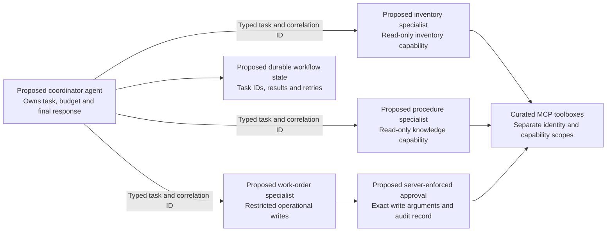

# From agent prototype to operated solution: the Fibey walkthrough

As AI agents move from experimentation toward production, the challenge shifts from model capability to orchestration, governance, and scale. This session uses Fibey, a synthetic fiber-operations assistant, to show how Microsoft Foundry Hosted Agents and Model Context Protocol (MCP) connect application code to tools and external systems through standardized, composable interfaces.

The audience is AI engineers and developers who want to design modular, reproducible systems rather than stop at a successful prompt. The walkthrough demonstrates a working single-agent solution and then explains the additional engineering required for production and multi-agent coordination. It does not describe the demo itself as production-ready.

Use the [Fibey presentation deck](slides/fibey-hosted-agents-mcp.pptx) for delivery. Its 16 slides preserve the supplied deck's visual style and include sample-specific speaker notes. Slide 9 introduces the hosted Azure architecture immediately before the slide 10 demo and its [actual deployed-app screenshot](images/fibey-live-app.jpg), captured on 2026-09-17. The older recording links remain labelled as background references; the live walkthrough below is the current sample path.

## Learning outcomes and evidence

Start with the technician's job, not the cloud resource list: preparing a work order requires stock, procedures, and service status from different systems. MCP standardizes the tool boundary; Foundry provides the managed execution environment, identities, and observability integration.

Each learning outcome below has something concrete to inspect. Where the session discusses a future design rather than deployed functionality, that distinction is part of the explanation.

| Session objective | What to show | Evidence or boundary |
|---|---|---|
| Connect agents, tools, and external systems | Inventory MCP, Work Orders OpenAPI, and Foundry IQ through one toolbox | Live tool schemas and successful synthetic tool results |
| Demonstrate dynamic tool use | A simple lookup followed by a combined job briefing | Skill load and tool activity; do not invent missing discovery meta-tools |
| Explain managed hosted execution | Hosted container, model, Responses protocol, and SDK integration | `azure.yaml` and `src/fibey/agent/hosted.py` |
| Explain security and identity | Entra UI boundary and separate runtime/downstream identities | Sign-in/deny checks and scoped role assignments |
| Separate control and data planes | Provisioned Search versus authorized knowledge retrieval | Ingestion result plus an actual cited retrieval |
| Design for DevOps and GitOps | Reviewed Bicep, locked builds, images, and toolbox versions | Staged deployment; no existing CI/CD or reconciliation controller claimed |
| Debug failures | Follow one request across UI, gateway, hosted agent, and tools | Activity sidebar, identifiers, redacted logs, and configured traces |
| Discuss multi-agent coordination | Specialist-agent extension diagram and handoff design | Architecture discussion only; five skills are not five agents |
| Assess production readiness | Identify state, approval, isolation, and scale gaps | Explicit hardening backlog rather than an enterprise-readiness claim |

## Practical walkthrough

Use a dedicated synthetic-data environment prepared with the [deployment guide](../deployment_guide.md). Before presenting, verify the protected UI, all eleven operational tools, knowledge citations, follow-up context, and reset behavior. Do not rely on an earlier deployment's success.

The sequence grows from one tool to a multi-system task. Model-selected ordering and generated wording can vary; show the observable operations and grounded results, not an exact prewritten answer.

### Establish the hosted boundary

Open the [engineering architecture](architecture.md) and the hosted service in `azure.yaml`. Point out the GPT-5.4-mini deployment, Responses `2.0.0`, five supporting ACA apps, and Foundry-managed agent compute. Explain that the UI's Entra sign-in is not an end-user identity passthrough to every tool.

In `hosted.py`, show `FoundryToolbox`, the five bundled skills, and `ResponsesHostServer.run_async()`. The SDK carries authenticated runtime context and call IDs; the developer owns the instructions and tool-use behavior. No custom browser-automation service or sixth agent Container App is deployed.

### Start with inventory, then retrieve a work order

Ask: **"Which OTDR equipment is in stock?"** Show the inventory skill and MCP search/stock activity. The facts come from a synthetic service, not from the model's training knowledge.

Ask: **"Show me WO-007."** Show how the same agent reaches an OpenAPI operation through the toolbox. Explain the distinction between a tool schema, its connection, and the credential stored on that connection.

### Add grounded knowledge and status

Ask: **"Find the documented fiber-splicing safety procedure."** Show retrieved document references and citations. Trace the source from bundled Markdown to Blob Storage, the Search index, the knowledge source/base, and its MCP endpoint.

Ask: **"Check the network status."** Show `get_network_status` on the inventory connection. It reads a fixed internal HTML dashboard; it cannot navigate an arbitrary website. These are synthetic network readings, not an operational clearance to perform a real cutover.

### Combine tools into one briefing

Ask: **"Brief me on WO-007, including stock, relevant procedures, safety, and network status."** The `field-briefing` skill guides work-order lookup, batched inventory checks, knowledge retrieval, and status inspection.

Show that the final answer combines successful tool results and cites knowledge sources. A multi-tool briefing is orchestration by one agent, not multi-agent delegation. If a backend fails, the correct demonstration is a clearly reported gap, not an invented stock figure or procedure.

### Demonstrate continuity and a disposable write

Ask a follow-up such as **"Which of those parts are low in stock?"** Explain response history versus hosted compute-session affinity. Reset chat and start a new question; reset clears chat mappings, not work orders.

In a dedicated rehearsal environment, first read WO-007's current state. Ask **"Set the synthetic WO-007 status to in_progress, then read it back."** Verify the returned state. State explicitly that no enforced approval UI intervenes. If a write response is uncertain, read back before retrying; repeating an uncertain create can duplicate work.

Restore the previous status with a verified update if needed, or have the operator restart the single work-orders service to reload all seed data. Restart discards every in-memory work-order change and is an operator action, not an agent reset tool.

## Governance and debugging discussion

Role-based access control (RBAC) answers which identity can perform which operation on which resource. Use the [identity matrix](architecture.md#identity-network-and-permission-boundaries) to distinguish the browser user, gateway identity, hosted agent identity, Foundry project identity, and Search identity.

The control plane creates and configures resources; the data plane performs application work. An operator can successfully provision a Search service and still lack permission to query its index. Similarly, registry access requires both an image-pull role and an ACA registry-identity association.

| Demonstration or discussion | Engineering lesson |
|---|---|
| Unauthenticated UI redirects; non-allowlisted user is denied | Check the actual protected entrypoint, not just app health |
| Inventory/orders reject missing API keys | One toolbox endpoint still has multiple downstream authentication boundaries |
| Search retrieval fails despite successful provisioning | Check project identity, Search data role, indexer completion, and MCP schema/API version |
| Hosted startup cannot enumerate tools | A failing toolbox source can block discovery; inspect its endpoint, credential, and published version |
| UI returns 502 | Verify Nginx upstream, target port, revision health, SNI, and trusted certificate chain |
| Multi-tool requests receive 429 | Model quota, concurrency, and retrieval budgets are separate capacity concerns |
| Stream is truncated | Show an error rather than presenting partial text as a completed operation |

For failure demonstrations, prefer redacted captured evidence or an isolated local test. Do not weaken a shared environment's access controls, rotate shared credentials, or remove roles merely to generate an error on stage.

Show the activity sidebar first, then locate the matching session/request or trace identifiers in the appropriate logs. The sidebar is not an audit store. Hosted OpenTelemetry is enabled, but confirm the project-linked telemetry sink is receiving data before presenting it; do not enable sensitive content tracing for real user data.

## Multi-agent coordination: extension, not deployed

The current solution deploys one hosted agent with five instruction skills. Those skills are a useful place to identify future specialist responsibilities, but they do not create independent agents, identities, message queues, or handoffs.

Use the following diagram to discuss how the same composable tool boundaries could support a coordinator and specialists. Every node in this diagram is a **proposed extension**, not an additional resource that `azure.yaml` deploys. Reusing a toolbox alone does not implement coordination.

Define a handoff before choosing a transport: include a task/correlation ID, work-order ID, allowed operation, input schema version, deadline, and result schema. Return evidence, status, and errors, not just unstructured prose. Use a framework workflow or a supported agent-to-agent protocol with explicit authentication; MCP remains the tool boundary.

Give read-only specialists narrowly scoped toolboxes and credentials. The coordinator should merge independent reads, propagate cancellation and deadlines, and cap tokens, calls, and retries. A write needs durable idempotency, an approval bound to the exact arguments, and a read-back/receipt; an instruction saying "ask for approval" is not enforcement.

## From reproducible demo to reliable operations

The [deployment guide](../deployment_guide.md#devops-gitops-and-release-management) describes a release path based on reviewed source, locked dependencies, immutable artifacts, explicit toolbox promotion, and acceptance evidence. GitOps is a desired-state operating practice, not a synonym for storing code in Git.

Close the session by identifying the application's remaining responsibilities. A managed runtime can supply identity, compute lifecycle, and telemetry integration while the application still needs durable state, ownership checks, approved writes, network policy, evaluation, recovery, and service-level objectives.

| Current sample | Production engineering follow-through |
|---|---|
| Single-replica gateway and synthetic order service | Externalize state before scaling replicas; test concurrent sessions and recovery |
| Unattended synthetic writes | Implement server-side approval, audit trail, and idempotency |
| UI login and allowlist | Enforce per-user session ownership and downstream authorization |
| Tool activity and optional linked tracing | Verify telemetry, define alerts/SLOs, and control retention/redaction |
| Manual staged deployment | Add CI checks, federated deployment identity, review gates, drift detection, and rehearsed rollback |
| One agent using several tools | Introduce specialists only when measurable complexity or isolation needs justify them |

The takeaway is a concrete engineering pattern: separate model reasoning, tool contracts, runtime hosting, and operational controls, then verify each boundary. Fibey makes those boundaries visible without pretending that a successful demo has completed the production journey.
